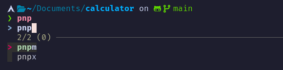

## My .zshrc file




to use it make sure u have following dependencies

- make sure your terminal support true colours and icons. use nerd fonts for terminal

- install dependenices `git`, `zsh`, `fzf`, `zoxide`, `thefuck`

```bash
# Ubuntu or any debian based distro
sudo apt install zsh git fzf zoxide thefuck

# Arch based distro
yay -S zsh git fzf zoxide thefuck # replace yay with paru if u use paru

```

```bash
# install my .zshrc
git clone https://github.com/MannuVilasara/dotZshrc.git
cd dotZshrc
mv .zshrc ~/
zsh

```

Make sure to star the repo ⭐